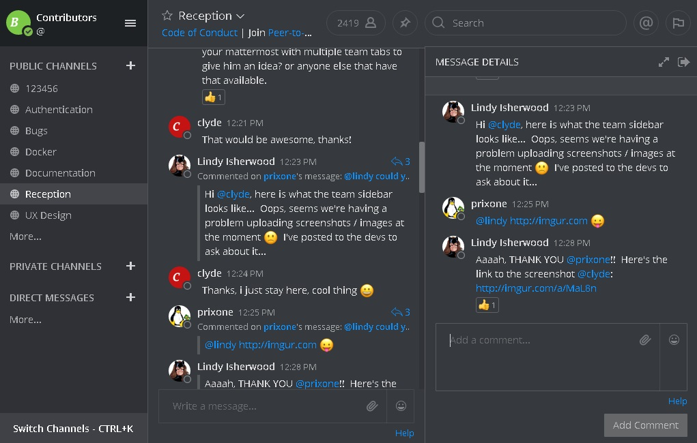

# Mattermost "Discord" dark theme
A theme for Mattermost trying to approach Discord's dark theme.



## Usage
In Mattermost:
1. click on User menu, select Account Settings
1. select Display, edit Theme
1. copy and paste the string below in the appropriate box
1. hit save and enjoy

```json
{"sidebarBg":"#2f3136","sidebarText":"#ffffff","sidebarUnreadText":"#ffffff","sidebarTextHoverBg":"#302e30","sidebarTextActiveBorder":"#196caf","sidebarTextActiveColor":"#ffffff","sidebarHeaderBg":"#1e2124","sidebarHeaderTextColor":"#ffffff","onlineIndicator":"#7ebd4d","awayIndicator":"#c1b966","mentionBj":"#01a2e7","mentionColor":"#ffffff","centerChannelBg":"#36393e","centerChannelColor":"#dddddd","newMessageSeparator":"#cc2d83","linkColor":"#0d93ff","buttonBg":"#0177e7","buttonColor":"#ffffff","errorTextColor":"#ff0400","mentionHighlightBg":"#4a4539","mentionHighlightLink":"#7289da","codeTheme":"monokai"}
```

## Color scheme
-  `#1E2124`
-  `#2F3136`
-  `#36393E`
-  `#72767D`
-  `#F2F2F2`

The color scheme is also available at:
- https://coolors.co/1e2124-2f3136-36393e-72767d-f2f2f2


## Update August 2018
User "mantas" on the mattermost forum provided another variant which I think better resembles discord's look and feel.  
You can find it here: https://forum.mattermost.org/t/share-your-favorite-mattermost-theme-colors/1330/13  
Here's the string (in case the url dies):
```json
{"sidebarBg":"#2F3136","sidebarText":"#9ca0a4","sidebarUnreadText":"#ffffff","sidebarTextHoverBg":"#42464D","sidebarTextActiveBorder":"#42464D","sidebarTextActiveColor":"#ffffff","sidebarHeaderBg":"#282B30","sidebarHeaderTextColor":"#ffffff","onlineIndicator":"#43B581","awayIndicator":"#FAA61A","mentionBj":"#F04747","mentionColor":"#ffffff","centerChannelBg":"#36393E","centerChannelColor":"#C0C1C2","newMessageSeparator":"#CB4445","linkColor":"#7289DA","buttonBg":"#7289DA","buttonColor":"#ffffff","mentionHighlightBg":"#3D414E","mentionHighlightLink":"#7289DA","codeTheme":"monokai"}
```
